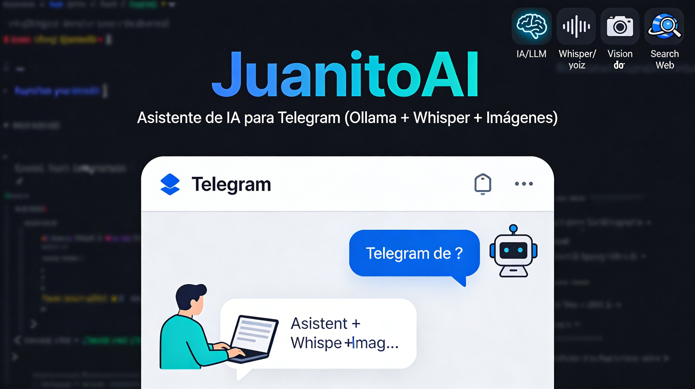

# JuanitoAI — Asistente de IA Multicanal y Modular

JuanitoAI es un asistente de Inteligencia Artificial ("bot") diseñado inicialmente para Telegram, pero refactorizado con una arquitectura core modular para permitir la futura integración con otros canales.

<div align="center">
  
</div>

El bot combina potentes modelos de lenguaje a través de Ollama, capacidades de visión, reconocimiento de voz usando Whisper, y generación de imágenes mediante modelos libres. Todo gestionado con una base de datos local (SQLite) para mantener el contexto, el humor y la memoria semántica a largo plazo de los usuarios.

## Características Principales

Juanito está diseñado para ser **privado**, **local** y altamente personalizable:

- **Modelos LLM Locales / Cloud (Ollama):** Configura cualquier modelo de texto soportado por Ollama para el razonamiento principal.
- **Visión Artificial:** Analiza fotos mediante un modelo de visión (como LLaVA) para interpretar imágenes y responder sobre ellas.
- **Reconocimiento de Voz (Whisper):** Transcripción local de notas de voz. Si el audio es excesivamente largo (+1 minuto), genera un resumen ejecutivo automático.
- **Memoria y Contexto Persistente:** Utiliza SQLite para el historial de la conversación. Incorpora un sistema de "humor" cambiante y una **memoria semántica** que extrae hechos biográficos del usuario en segundo plano para personalizar futuras respuestas.
- **Generación de Imágenes Fotorealistas:** Genera imágenes directamente en la conversación apoyándose en la API de HuggingFace Inferencia (FLUX / SDXL).
- **Sistema de Notas y Recordatorios:** Herramientas de productividad para guardar apuntes (`/nota`) y programar avisos temporales asíncronos (`/remind`).
- **Investigación Web Profunda:** Dos modos operativos: búsqueda rápida (`/search`) e investigación profunda (`/deepsearch`), donde un agente autónomo descarga webs enteras y extrae bibliografía real.
- **Soporte de Documentos:** Lee y contesta sobre archivos de texto planos (`.txt`, `.md`, `.csv`).
- **Seguridad y Rate Limiting:** Soporte integrado de "whitelists" de usuarios permitidos, límites de mensajes por minuto para evitar abusos, y roles de administrador.

---

## Arquitectura

El proyecto separa de forma estricta la lógica de los adaptadores específicos de cada red social (actualmente solo Telegram).

```text
juanitoAI/
├── core/                           # Lógica central (Agnóstica a plataformas)
│   ├── config.py                   # Variables de entorno y logging
│   ├── database.py                 # Gestión SQLite (historial, notas, perfiles)
│   ├── llm.py                      # Wrapper para Ollama AsyncClient
│   ├── speech_to_text.py           # Wrapper para el modelo Whisper local
│   ├── web_search.py               # Motor de búsquedas simples y profundas
│   ├── models.py                   # Clases de dominio
│   └── services/
│       ├── conversation.py         # Orquestador del pipeline de chat
│       ├── image_generation.py     # Gestor multiproveedor de imágenes HF
│       ├── scheduler.py            # Demon de recordatorios en segundo plano
│       ├── semantic_memory.py      # Extracción periódica de hechos de usuarios
│       └── monitoring.py           # Stats del servidor (RAM, CPU, Disco)
│
├── channels/                       # Adaptadores para canales de chat
│   ├── telegram/                   # Cliente nativo de Telegram
│   │   ├── handlers.py             # Controladores de comandos puros
│   │   └── mapper.py               # Serializador de Telegram a core.Message
│
└── Telegram_AI_bot.py              # Entrypoint principal y orquestador
```

---

## Instalación y Requisitos

Para correr Juanito, es recomendable usar un entorno virtual para evitar conflictos de dependencias.

### 1. Requisitos previos
- **Python 3.9+**
- **Ollama** instalado y ejecutándose localmente o accesible vía red.
- **FFmpeg** (requerido por Whisper para procesar los audios):
  - Ubuntu/Debian: `sudo apt update && sudo apt install ffmpeg`
  - macOS: `brew install ffmpeg`

### 2. Entorno virtual e Instalación
```bash
# Crear entorno virtual
python3 -m venv venv
source venv/bin/activate

# Instalar dependencias
pip install -r requirements.txt
```

### 3. Configuración (`.env`)
Antes de iniciar, debes preparar tus API keys. Copia el archivo de ejemplo:
```bash
cp ejemplo.env .env
nano .env
```
_(Ver la sección de Variables de Entorno)_.

### 4. Lanzamiento (Local)
```bash
# Iniciar el bot de forma normal dentro de una screen/tmux
python Telegram_AI_bot.py
```

### 5. Lanzamiento con Docker (Recomendado para VPS)
Si prefieres un despliegue limpio y autogestionado, Juanito incluye una configuración de `docker-compose`:
```bash
# Iniciar el bot y una instancia local de Ollama en contenedores
docker-compose up -d
```
_Nota: Asegúrate de tener configurado tu `.env` antes de levantar los contenedores._

---

## Pruebas (Testing)

El core del bot cuenta con una batería de pruebas unitarias usando `pytest` para garantizar la estabilidad de la persistencia de datos y manipulación de contexto.

Para ejecutar los tests localmente:
```bash
# 1. Instalar dependencias de desarrollo
pip install -r requirements-dev.txt

# 2. Ejecutar Pytest
pytest tests/
```

---

## Variables de Entorno (`.env`)

| Variable | Descripción | Ejemplo |
|----------|-------------|---------|
| `TELEGRAM_TOKEN` | Tu token del BotFather de Telegram. | `123456...` |
| `OLLAMA_MODEL_CHAT` | Modelo principal para texto. | `kimi-k2.5:cloud` |
| `OLLAMA_MODEL_VISION` | Modelo auxiliar para imágenes. | `gemma3:27b-cloud` |
| `WHISPER_MODEL_SIZE` | Tamaño del modelo STT (tiny, base, small...). | `base` |
| `DB_PATH` | Ruta a la base de datos local SQLite. | `juanito_bot.db` |
| `ALLOWED_USER_IDS` | IDs de Telegram permitidos (separados por coma). Vacío = Abierto a todos. | `1234,9876` |
| `ADMIN_USER_IDS` | IDs o **@usernames** de administradores. | `@admin,123` |
| `RATE_LIMIT` | Control antispam:`RATE_LIMIT_MESSAGES` / `RATE_LIMIT_WINDOW` (msgs/segs) | `20`, `60` |
| `HF_API_TOKEN` | Token gratuito de lectura de HuggingFace para generación de imágenes (hf_...). | `hf_xxxxx...` |

---

## Comandos y Capacidades

### Comandos Generales
- `/start` - Despierta al bot y muestra el mensaje inicial literario.
- `/help` - Despliega el menú categorizado de ayuda funcional.
- `/clear` - Borra el historial conversacional y de sesión del usuario.
- `/mood` y `/mood <estado>` - Visualiza o inyecta a la fuerza una personalidad temporal.
- `/img <prompt>` - Traduce tu prompt, procesa la solicitud con FLUX/SDXL, y manda una imagen generada.
- `/remind <minutos> <tarea>` - Encola un trabajo asíncrono para ser invocado N minutos después en el chat.
- `/nota <apunte>` - Escribe silenciosamente una nota persistente.
- `/notas` - Recupera la lista completa de apuntes manuales para lectura.
- `/search <texto>` - Utiliza el API de DuckDuckGo para recuperar un extracto flash web.
- `/deepsearch <consulta>` - Detona un scraping pasivo; el bot descarga múltiples artículos crudos, los lee mediante LLM y emite una investigación citada.

### Comandos de Administración
- `/vps` - Analiza el uso de CPU, RAM Swap y FS Disk del host.
- `/models` - Hace ping al servidor Ollama devolviendo el listado bruto JSON de pesos.

### Tareas en Segundo Plano (Sin comandos explícitos)
- **Extracción Biográfica (Memoria Semántica):** Juanito captura sentencias factuales sobre el interlocutor en _background_ cada cierto número de turnos. Este compendio se inyecta pasivamente en prompts futuros.
- **Resumidor Transcriptor:** Audios que superen el límite sintáctico de tokens tras pasar por el pipe de Whisper son cortocircuitados hacia un sub-agente dedicado que esquematiza la información del audio, previniendo el desbordamiento conversacional.

## Video de demostración

[](https://youtube.com/shorts/QmIJVwPXUBw)

## Desarrollador

Creado y diseñado por **David Carreres Gómez**.
